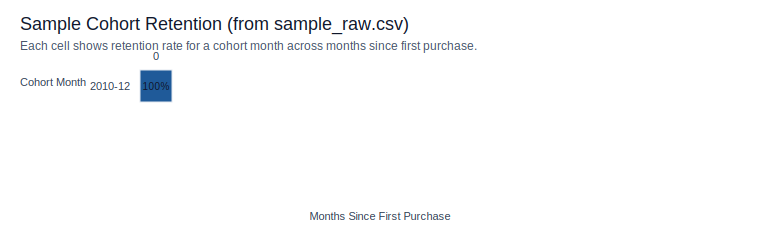

# E-Commerce Analytics: SQL & Customer Retention Analysis


A reproducible analytics pipeline that transforms raw e-commerce transactions into clean datasets, revenue KPIs, and cohort retention insights, implemented in both Python and SQL.

## Highlights

- End-to-end data cleaning with clear business rules (cancellations, returns, invalid values)
- Revenue and order KPIs by month, including AOV
- Customer-level behavior analysis and cohort retention
- SQL mirror in DuckDB to validate parity with Python outputs

## Results

Headline results (sample dataset):

- Monthly revenue and AOV trends are stable after cleaning.
- Cohort retention shows a clear drop-off after the first month.
- Early cohorts retain meaningfully more customers than later cohorts.

Note: The visualization below is generated from `data/sample_raw.csv`.



## Business Questions

- How does revenue evolve over time?
- How many orders are placed each month and what is the average order value?
- How do customers behave over their lifetime?
- How strong is customer retention by acquisition cohort?
- Can Python-based analytics be faithfully reproduced using SQL?

## Dataset

- Source: [Kaggle - Ecommerce Data](https://www.kaggle.com/datasets/carrie1/ecommerce-data)
- Time range: 2010 to 2011
- Unit of analysis: transaction-level line items within invoices

The raw dataset includes common real-world issues such as canceled orders, returns, missing customer IDs, and invalid values.

## Data Files

To keep the repository lightweight, large raw/cleaned datasets are not committed.
This repo includes `data/sample_raw.csv` (first 1,000 rows) for quick preview.
The full dataset is ~45MB as a CSV.

To run the full pipeline:
1. Download the dataset (CSV) from the [Kaggle dataset page](https://www.kaggle.com/datasets/carrie1/ecommerce-data).
2. Rename the CSV to `data/raw.csv`.

## Project Structure

```text
ecommerce-analytics/
├── assets/
│   └── retention_heatmap_sample.svg
├── data/
│   └── sample_raw.csv
├── notebooks/
│   ├── 01_data_cleaning.ipynb
│   └── 02_sql_analysis.ipynb
├── sql/
│   ├── schema.sql
│   └── queries.sql
├── .gitignore
├── .editorconfig
├── CONTRIBUTING.md
├── LICENSE
├── Makefile
├── README.md
└── requirements.txt
```

## How to Run

1. Clone the repository.
2. Create and activate a virtual environment.
3. Install dependencies.
4. Download the full dataset and save it as `data/raw.csv` (see Data Files section).

```bash
pip install -r requirements.txt
```

Or:

```bash
make setup
```

5. Run the notebooks in order.

- `notebooks/01_data_cleaning.ipynb`
- `notebooks/02_sql_analysis.ipynb`

See `notebooks/README.md` for expected outputs.

## Methodology

### Data cleaning and preparation

- Inspected raw transactions for quality issues
- Removed canceled invoices and invalid prices
- Preserved returns as business events
- Created revenue features and time-based fields
- Split datasets by analytical purpose: revenue reporting and customer analytics

Note: Canceled invoices are excluded from revenue KPIs by design. Returned transactions recorded as cancellations are therefore not counted in revenue.

### Revenue and KPI analysis

- Monthly order counts
- Gross and net revenue
- Average order value (AOV)

### Customer analytics

- Customer-level aggregation of orders, revenue, and recency
- Identification of high-value and at-risk customers

### Cohort retention analysis

- Cohorts defined by first purchase month
- Retention calculated over time
- Retention visualized using a heatmap

### SQL mirror

- All key analytics reproduced in DuckDB
- Parity validated between Python and SQL outputs
- SQL outputs exported for downstream BI use

## Project Notes

- Cancelled invoices (InvoiceNo starting with `C`) are excluded from revenue KPIs.
- Returns (negative quantities) are retained and reflected as negative revenue.
- Customer-level analysis excludes rows with missing `CustomerID`.

## Key Insights

- Customer retention varies significantly by acquisition cohort.
- Early cohorts, such as December 2010, show stronger long-term retention.
- Revenue KPIs and cohort metrics align consistently across Python and SQL.
- Separating revenue reporting from customer analytics improves analytical integrity.

## Tools and Technologies

- Python: pandas, matplotlib, seaborn
- SQL: DuckDB
- Jupyter Notebooks
- Git and GitHub

## Notes

This project emphasizes analytics correctness, reproducibility, and business reasoning over predictive modeling. The workflow mirrors real-world analytics practices and provides a foundation for future work in forecasting, customer lifetime value, and machine learning applications.
